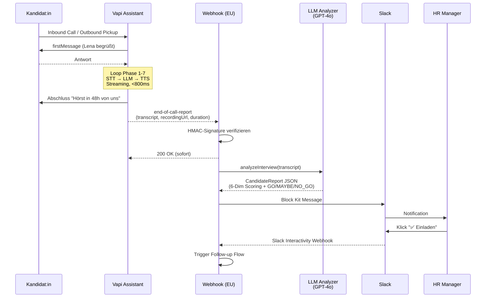
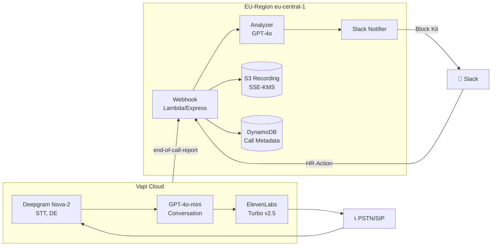

# End-to-End Flow Diagram

## Happy Path

```mermaid
sequenceDiagram
    participant K as Kandidat:in
    participant V as Vapi Assistant
    participant W as Webhook (EU)
    participant L as LLM Analyzer<br/>(GPT-4o)
    participant S as Slack #hr-candidates
    participant H as HR Manager

    K->>V: Inbound Call / Outbound Pickup
    V->>K: firstMessage (Lena begrüßt)
    K-->>V: Antwort
    Note over V: Loop Phase 1-7<br/>STT → LLM → TTS<br/>Streaming, <800ms
    V->>K: Abschluss "Hörst in 48h von uns"
    V-->>W: end-of-call-report<br/>(transcript, recordingUrl, duration)
    W->>W: HMAC-Signature verifizieren
    W-->>V: 200 OK (sofort)
    W->>L: analyzeInterview(transcript)
    L-->>W: CandidateReport JSON<br/>(6-Dim Scoring + GO/MAYBE/NO_GO)
    W->>S: Block Kit Message
    S->>H: Notification
    H->>S: Klick "✅ Einladen"
    S-->>W: Slack Interactivity Webhook
    W->>W: Trigger Follow-up Flow
```

## Komponenten-Übersicht

```mermaid
flowchart LR
    subgraph Vapi[Vapi Cloud]
        STT[Deepgram Nova-2<br/>STT, DE]
        LLM1[GPT-4o-mini<br/>Conversation]
        TTS[ElevenLabs<br/>Turbo v2.5]
    end

    subgraph EU[EU-Region eu-central-1]
        WH[Webhook<br/>Lambda/Express]
        AN[Analyzer<br/>GPT-4o]
        SL[Slack Notifier]
        S3[(S3 Recording<br/>SSE-KMS)]
        DB[(DynamoDB<br/>Call Metadata)]
    end

    Phone[📞 PSTN/SIP] --> STT
    STT --> LLM1
    LLM1 --> TTS
    TTS --> Phone

    Vapi -->|end-of-call-report| WH
    WH --> AN
    WH --> S3
    WH --> DB
    AN --> SL
    SL -->|Block Kit| Slack[💬 Slack]
    Slack -->|HR-Action| WH
```

## Latenz-Budget pro Turn (Ziel < 800ms)

```mermaid
gantt
    title End-to-End Latency Budget
    dateFormat X
    axisFormat %Lms

    section STT
    Endpointing Decision    :0, 250
    section LLM
    Time to First Token     :250, 450
    Streaming Output Start  :450, 500
    section TTS
    TTFB (ElevenLabs Turbo) :500, 800
    section Network
    Round-Trip Overhead     :800, 850
```
